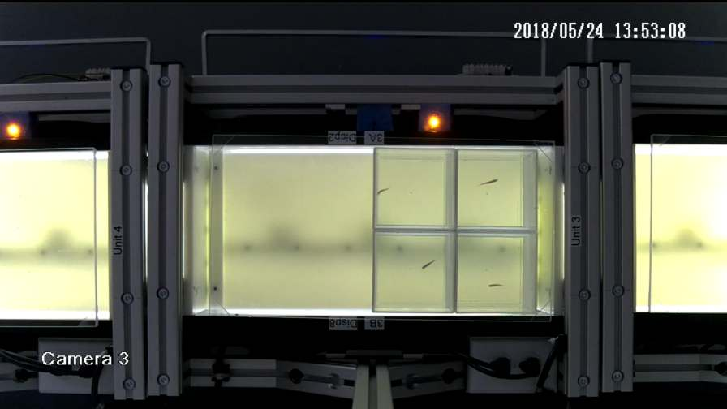
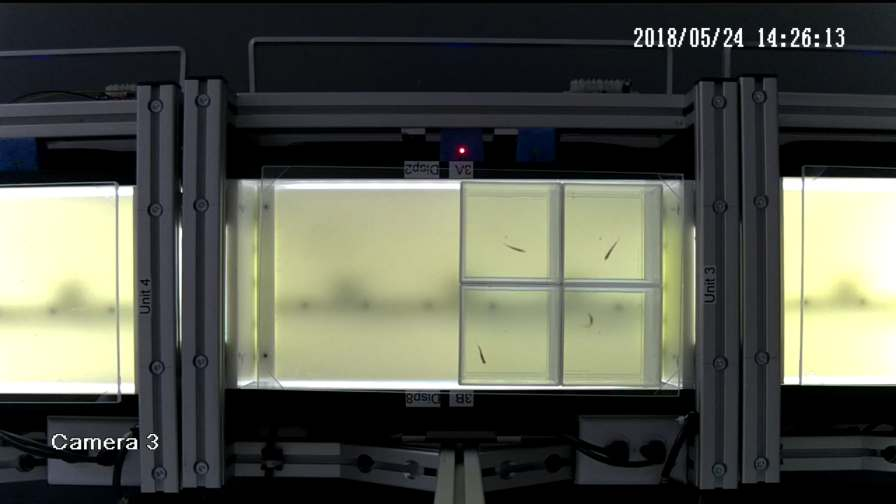
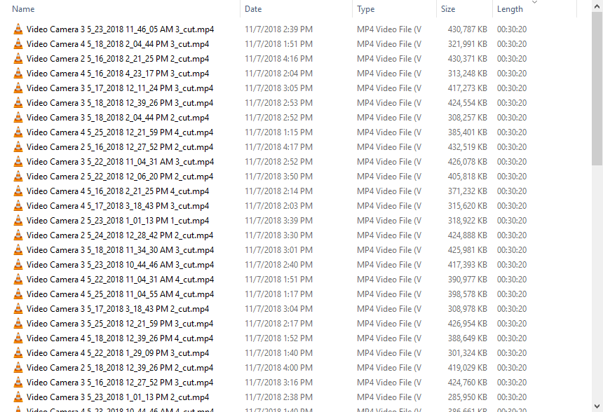
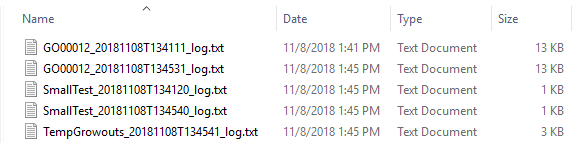

# Sideview Video Processor
This is a quickly thrown together tool to process the outputs of the old generation sideview assay at SARL.
The sideview unit records video of fish movement in response to external stimulus before getting fed into a motion 
analysis tool. However, due to the nature of this old version of the assay using people to provide the stimulus, there
are many timing errors that causes problems for the motion analysis software, and for proper alignment of data in 
post-processing. This tool solves this issue by normalizing the videos.

To explain how this application works, I will show below what the video is supposed to look like.

[video_start----assay_start-------------------------first_tap--tap--tap--tap--tap--tap--tap--tap--tap--tap--assay_end]

In the above timeline, there are leds that flash for the assay_start and for every tap. The correct timing is supposed 
to be 27 minutes between assay_start and first_tap, and then for each and every tap, there needs to be +/- 10 seconds
of video as there is ideally 20 seconds of time between each tap. So, with this picture in mind I'll now describe the 
features of the program I've made to normalize these videos, each of which are part of a group they internally call a 
growout. Each growout contains many videos, and in total there are many many hundreds of videos that need to undergo 
this processing.

* Loads a single growout or many growout folders
* Spins up multiple processes to handle each video (currently set to 4 processes at a time)
* Monitors the start led and tap led locations through each frame of the video
* Automatically begins saving video when the start led flashes
* At 27 minutes, it no longer saves video until the first tap led flashes
* At this point, it dumps out the 10 seconds prior to the first tap 
* For each subsequent tap, it determines the inter-tap time and pads (black frames) or cuts as needed for proper timing
* At the end, it writes out the last ten seconds before the individual process dies
* Provides simple log files with file names, processing success, processing failures, and invalid input video errors

The end result of this processing are video files that are 30 minutes, 19 seconds to 30 minutes, 20 seconds long that 
should be able to be put into the motion analysis tool with no trouble.

### How to Run
To run the version on the releases page, extract the contents, then run either the "Launch SideViewVideoProcessor.bat"
or "Launch SimultaneousVideoPlayback.bat" files. Python has been included as a local directory so that the application
is portable, more or less, and so that the python files are easily modifiable.

### Processing Power Note
This program is extremely intensive, especially when the number of processes is more than 1. If you go to use this I 
recommend starting at 1, check task manager to determine the single process performance, and adjust as necessary to 
find a healthy number that provide a little overhead for the system. My system with an i7-2600 and 8GB DDR3 could only 
handle 4 without pegging the cpu at 100%. 5 seemed like the right number if I were using this program server style and 
not as my main desktop too.

### Additional Program
While not something that's strictly part of this application, the SimultaneousVideoPlayback.py file is one I wrote that 
can be used to play back multiple videos in a grid style all synchronized by frame. This was very useful to test that 
cutting and alignment was working as intended, as I could not find an off the shelf program to do this quickly.

# Screenshots
### Start Light
 

### Tap Light

### Normalized Outputs
  

### Log Files

# Build Information
* Python 3.7 64-bit
    * opencv
    * numpy
    * tkinter
    * multiprocessing
* Executable built with pyinstaller